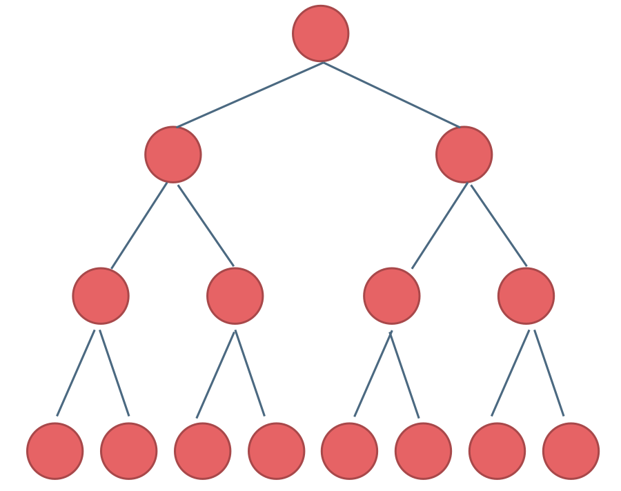
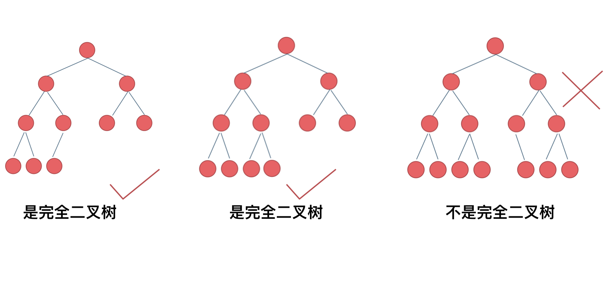
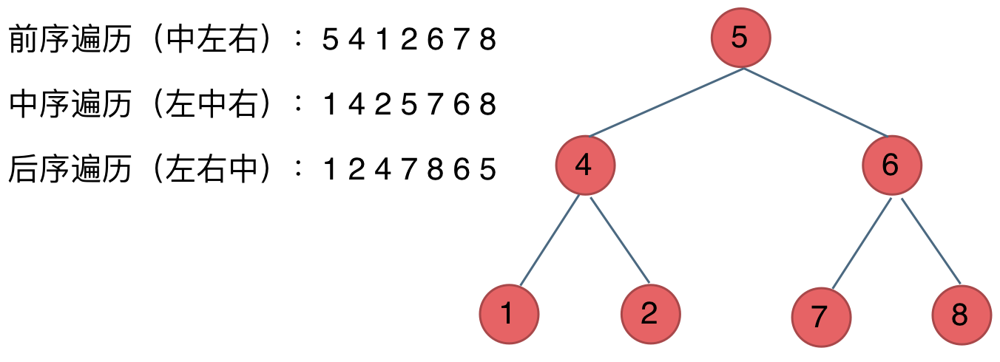

# 二叉树
## 分类
### 满二叉树
只有度为零的节点和度为二的节点，且度为零的节点在同一层上



也可以说深度为k，有2^k-1个结点的二叉树

### 完全二叉树
除了最底层节点没填满外，其他各层都是满的，且最底层的节点集中在左边。



优先级队列-堆-保证父子节点顺序关系的完全二叉树
PriorityQueue-二叉堆（小顶堆）

### 二叉搜索树（有数值，有序）
左子树不空-上面的所有节点都小于根节点
右子树不空-上面的所有节点都小于根节点
左右子树也是二叉搜索树
- 求最值求差用中序遍历变成数组

### 平衡二叉搜索树
空树/左右子树高度差小于1
TreeSet（包装TreeMap）和TreeMap的底层是红黑树（自平衡的二叉搜索树 ）
java 8之后，concurrentHashmap是Node数组+链表/红黑树

## 存储方式
可以链式存储（指针，不连续分布），也可以顺序存储（数组，连续分布；父节点i，左子节点2*i+1,右子节点2*i+2）

## 遍历方式
### 深度优先遍历(递归，栈)
#### 分类
前序遍历（中左右）
中序遍历（左中右）
后序遍历（左右中）

#### 方法
递归遍历94
迭代遍历（栈，入栈顺序是遍历的左右颠倒；统一迭代：用boolean做标记，或者多弹入一个空节点标记，只有被放入两次的才能拿出来）

层序遍历102
### 广度优先遍历（队列）

## 定义

```java
class TreeNode {
    int val;
    TreeNode left;
    TreeNode right;
    
    TreeNode(){}
    TreeNode(int val){
        this.val = val;
    }
    TreeNode(int val,TreeNode left,TreeNode right){
        this.val = val;
        this.left = left;
        this.right = right;
    }
}
```

## 例题
### 最小深度111
不能简单看成求min，那种一个下面只有一边接一串的深度很大
### 二叉搜索树中的众数501
普通树：全遍历，map求最大
二叉搜索树：转化成类数组（pre指针求）——集合：count=maxCount加入res，更新maxCount时清空结果集
### 二叉搜索树中的插入操作701
按规则遍历树，空位插入
### 二叉搜索树删除450
没找到返回，找到了分类讨论，叶子空，叶子左右一个空，叶子无空（左孩子放到右孩子的极限左孩子下）
### 修剪二叉搜索树669
该节点不满足的话移除节点，把满足的孩子接上去，继续排查
### 有序数组转换为二叉搜索树108
中间节点做根
### 把二叉搜索树转换为累加树538
看成数组，然后再用二叉树遍历
