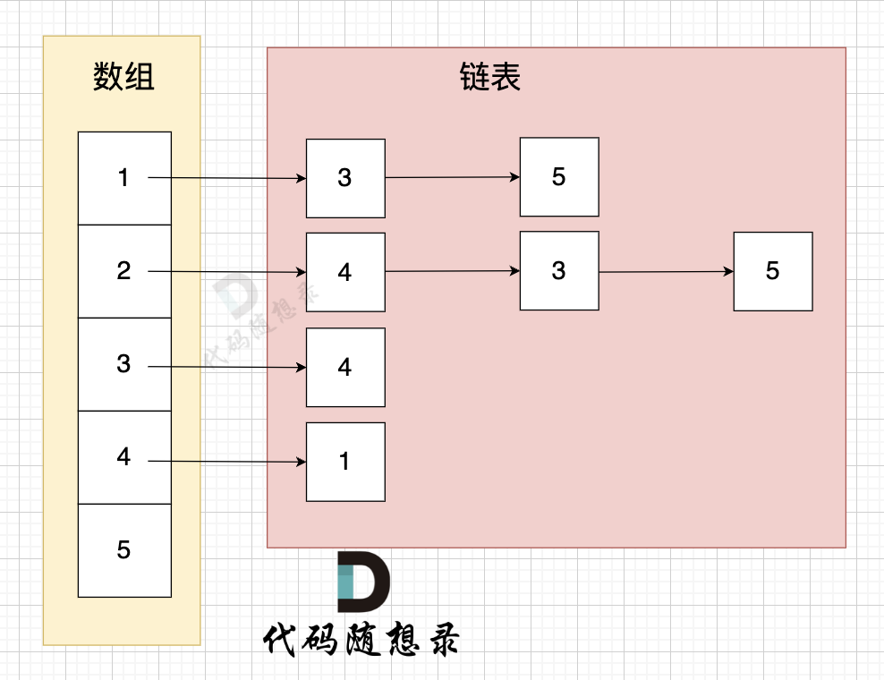

# 图论
## 基本概念
### 图
两点连成线，多点连成图（也可以只有一个节点/没有节点-空图）
#### 种类
有向图：边有方向
无向图：边没有方向
加权图：边有权值

### 度
无向图中有几条边连接节点，该节点就有几度
有向图
出度：从该节点出发的边的数量
入度：到达该节点的边的数量

### 连通性
在图中表示节点的连通情况
#### 连通图
无向图
任何两个节点之间都是可以到达的-连通图；非连通图
有向图
任何链各个节点之间都是可以到达的-强连通图
#### 连通分量
无向图中-极大连通子图-连通分量
有向图中-极大强连通子图-强连通分量

## 图的构造
邻接表，邻接矩阵，类
### 朴素存储
n*2数组，a指向b
### 邻接矩阵
二维数组 grid[i][j]= w(无向图增加grid[j][i]= w)
优点:
- 表达方式简单，方便理解
- 查询两个节点之间是否存在边很方便
- 在稠密图，即边数近似于节点的平方的图，空间效率较高
缺点：
- 稀疏图，空间浪费
- 遍历边，时间浪费
### 邻接表
数组（节点）+链表（边）

这里表达的图是：

节点1 指向 节点3 和 节点5
节点2 指向 节点4、节点3、节点5
节点3 指向 节点4
节点4指向节点1

优点：
- 稀疏图只要存边，空间利用率高
- 遍历边方便
缺点：
- 检查两个节点中是否存在边效率低，复杂度为O(V)
- 实现复杂，不易理解

## 图的遍历方式
### 深度优先搜索（DFS）
类似二叉树递归
一个方向搜索，搜不到回溯

### 广度优先搜索（BFS）
类似二叉树层序
本结点连接的所有节点搜一遍，下一个再搜下一个结点的

## 例题
### 孤岛的沉没
从周边一圈出发把岛屿都标记一遍
先改2再改1
### 水流问题
从两组边界出发取交集，注意两个标记数组
### 建造最大工岛
记录每个岛屿的标号，map存面积
变1上搜索岛屿，面积之和。
### 岛屿的周长
不是叫你算单独每一个

